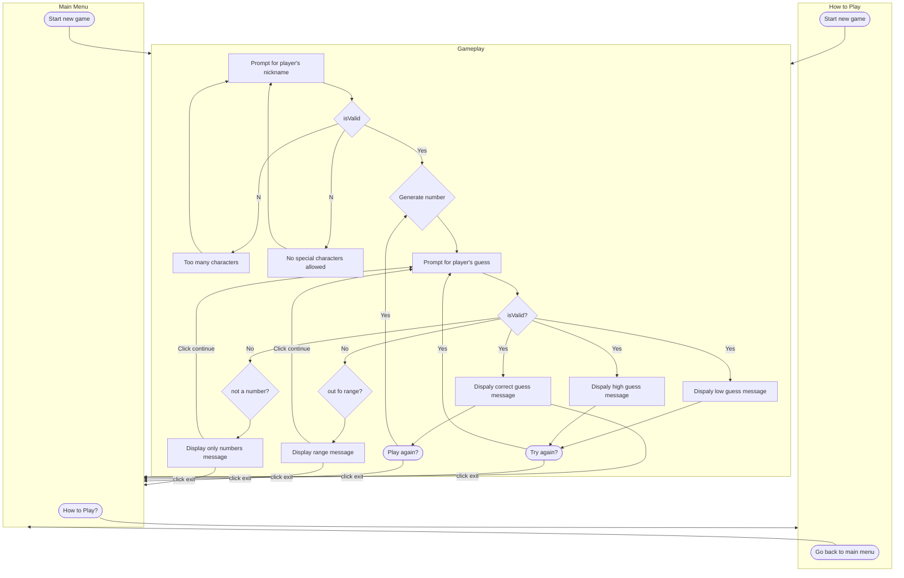

Description
---

#### Main Menu
- Starting point to game
- User can go to how to play page
- User can start new game

#### How to Play
- Displays rules
  - Number between 1 and 100
  - No negatives
- User can start a new game
- User can go back to main menu

#### Gameplay
-Start of new game
1. User is prompted for a nickname
  - If not valid message is displayed and user can click continue to re-enter  
    *Invaild entries*
    - More than 15 characters
    - Non-numbers and non-letters
2. Generates a random number
3. User is prompted for a guess
  1. Guess too high  
    - Display high message  
    - User can try again  
    - User can exit game to main menu  
  2. Guess too low  
    - Display low message  
    - User can try again  
    - User can exit game to main menu
  3. Guess is not valid  
    - Display not valid message  
    - Press continue to re-enter a number  
    - User can exit to main menu  
  4. Guess is correct  
    - Display correct message  
    - User can play agian --> Game generates new number  
    - User can exit to main menu  
  5. User can exit to main menu

  
